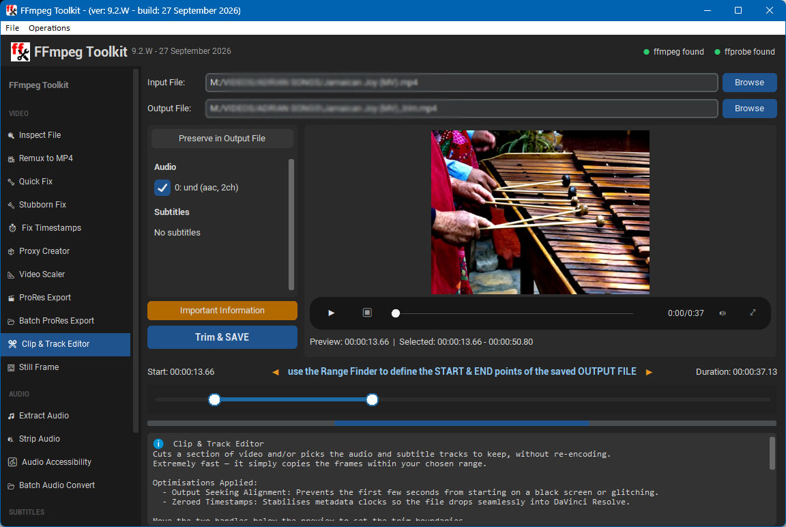

# FFmpeg Toolkit 🎬🔧

A Vibe Coded, feature-rich, dark-themed desktop GUI for [FFmpeg](https://ffmpeg.org) built with Python and CustomTkinter, for **Windows** and **Linux**.
Designed for content creators who work with audio editors and video editors such as [DaVinci Resolve](https://www.blackmagicdesign.com/products/davinciresolve) — fix, convert, inspect and process video files without touching the command line.

---

## 📸 Screenshot

**Main Interface — v9.2 (Clip & Track Editor)**


---

## ✨ Features

> 🖱️ The sidebar scrolls vertically — if the window is smaller than the full tool list, a scrollbar appears so every item stays reachable.

### 🎥 Video

| Tool | Description |
|------|-------------|
| **Inspect File** | Employs a clean background `ffprobe` pipe to map stream properties, codecs, aspect ratio and multi-channel audio layouts without filling the log window with build noise. |
| **Remux to MP4** | Converts any video file (MKV / AVI / MOV / WMV / etc.) into an MP4 container. Copies the video track instantly with zero loss while safely transcoding audio tracks to standard AAC to prevent container crashes on raw Blu-ray audio formats. Retries with a full H.264 re-encode if the video stream copy fails. |
| **Quick Fix** | Remuxes video into a new container instantly by copying all streams without re-encoding. Fixes broken file indexing. |
| **Stubborn Fix** | Specifically optimized for DaVinci Resolve import errors. Forces a fast video stream copy but converts the audio track into uncompressed 16-bit PCM wrapped in a `.mov` container — ensuring the audio track never goes missing on the editing timeline. |
| **Fix Timestamps** | Rebuilds corrupt or missing presentation timestamps using `+genpts+igndts`, eliminating playback stuttering and audio sync drift in Resolve. |
| **Proxy Creator** | Generates lightweight, editing-optimized `.mov` proxies with Rec.709 colour tags (no washed-out gamma shift in Resolve) and uncompressed PCM audio for lag-free scrubbing. |
| **Video Scaler** | Resizes a video for sharing, uploading or saving space. Resolution presets (2160p…360p) set the *short* side so portrait phone video is handled correctly; also 50% / 25% and custom sizes. |
| **ProRes Export** | Converts video to Apple ProRes (Proxy / LT / 422 / HQ / 4444 / 4444 XQ). Smart colour tagging, HDR handling (keep HLG/PQ or tone-map to SDR Rec.709), constant-frame-rate conforming for phone footage, every audio track as 24-bit PCM, and an up-front output size estimate with a free-space check. |
| **Batch ProRes Export** | The same ProRes conversion for a whole folder at once, with per-file size estimates and select all / none. |
| **Clip & Track Editor** | Losslessly cuts a section of video and/or picks which audio and subtitle tracks to keep, without re-encoding. Built-in preview player and a range slider for the start and end points. Uses output seeking to avoid black or frozen first frames and zeroes timestamps for Resolve. |
| **Still Frame** | Extracts a frame-accurate single image from any timestamp using precise output seeking and high-quality scaling (`-sws_flags accurate_rnd+spline`). |

### 🎵 Audio

| Tool | Description |
|------|-------------|
| **Extract Audio** | Saves an audio track as a standalone file — uncompressed WAV (PCM) or AAC (`.m4a`). Pick one language track or all tracks (one file each). Surround tracks can be saved as-is, downmixed to stereo, or reduced to the dialogue (centre) channel. |
| **Strip Audio** | Removes the audio while keeping the video, cover art and subtitles intact (`-map 0:v -map 0:s?`). |
| **Audio Accessibility** | Custom-built accessibility tool for those who are hard of hearing — normalizes loudness before importing into DaVinci Resolve. Choose **Dynamic Normaliser** (`dynaudnorm`) for content-adaptive smoothing, or **Loudness Compression** (`loudnorm`) targeting **-14 LUFS** (YouTube/Spotify), **-16 LUFS** (Apple Music), **-20 LUFS** (a custom preset tuned for older film dialogue), **-23 LUFS** (Broadcast/EBU R128) or **-27 LUFS** (Netflix/Amazon). Process one language track or all of them, optionally downmix surround to a clear-dialogue stereo track, and pick **PCM** or **AAC** audio in an **MKV**, **MOV** or **MP4** container. Every run also writes an **`FF-Toolkit Conversion Report.txt`** documenting the input/output specs and the settings applied. |
| **Batch Audio Convert** | Bulk-converts an entire folder of files (or a single file) in the background, with live progress and case-insensitive scanning. |

### 💬 Subtitles

| Tool | Description |
|------|-------------|
| **Subtitles Extractor** | Saves the subtitle tracks inside a video as standalone files. Pick one track (listed with its language plus forced/SDH flags) or **All tracks** (one file each). Keep each track's original format (SRT → `.srt`, ASS → `.ass`, WebVTT → `.vtt`, MP4 `mov_text` → `.srt`) or convert text subtitles to **SRT**, **WebVTT** or **ASS**. Picture subtitles (PGS, VobSub, DVB) can't become text without OCR, so they are always saved as they are: PGS as `.sup`, VobSub and DVB as a subtitle-only Matroska file (`.mks`). |

### 🛠️ Tools

| Tool | Description |
|------|-------------|
| **Custom Command** | Build your own FFmpeg command using a checkbox builder, or type/paste any command directly. |
| **Settings** | Set the FFmpeg location, a default output folder, and remember the last-used input folder. |

---

## 🖥️ Requirements

- **Windows 10/11** or **Linux** (Mint, Ubuntu, Debian and relatives)
- **FFmpeg & FFprobe**
  - Windows: place `ffmpeg.exe` and `ffprobe.exe` in the same folder as the app (or have them on your PATH)
  - Linux: installed automatically by `install.sh`
- **Python 3.10+** — only needed to run from source or build the Windows executable

> Download FFmpeg for Windows from [ffmpeg.org/download.html](https://ffmpeg.org/download.html) (e.g. the gyan.dev "essentials" build).

---

## 🚀 Quick Start (Windows)

### Option A — Download the portable EXE
1. Go to **Releases** (right-hand side of this page) and download `ffmpeg_toolkit_v9-2-W.exe` from the **Assets** of the latest release.
2. Put copies of `ffmpeg.exe` and `ffprobe.exe` in the same folder.
3. Double-click the EXE — no installation needed.

> In some cases a copy of FFmpeg already on your computer will be found and used.

### Option B — Build the EXE yourself
1. Download this repository (**Code → Download ZIP**) and extract it.
2. Double-click `build.bat` and, when asked, enter the number shown next to `ffmpeg_toolkit_v9-2-W.py`.
3. The finished `ffmpeg_toolkit_v9-2-W.exe` appears in the new `dist\` folder. Copy it, with `ffmpeg.exe` and `ffprobe.exe`, to any folder you like.

### Option C — Run from source
```bash
pip install -r requirements.txt
python ffmpeg_toolkit_v9-2-W.py
```

---

## 🐧 Quick Start (Linux)

Everything for Linux is in the **`LINUX PACKAGE`** folder.

1. Copy the `LINUX PACKAGE` folder to your home folder.
2. Open a terminal in that folder and run:
   ```bash
   bash install.sh
   ```
   It installs FFmpeg and Python's window toolkit (asks for your password), creates a private Python environment with CustomTkinter and Pillow, and adds **FFmpeg Toolkit** to the applications menu and the desktop.
3. Start the app from the applications menu, the desktop icon, or:
   ```bash
   ./run.sh
   ```

See [`LINUX PACKAGE/README.txt`](LINUX%20PACKAGE/README.txt) for updating, troubleshooting, uninstalling and building an optional stand-alone Linux program.

---

## 📁 File Structure

```
FFmpeg-Toolkit/
├── ffmpeg_toolkit_v9-2-W.py     # The app (Windows)
├── build.bat                    # Builds the Windows EXE with PyInstaller
├── generate_ico.py              # Regenerates app_icon.ico during the build
├── icon_source.jpg              # Artwork for the icon
├── app_icon.ico                 # Window / EXE icon
├── Ffffreddy.mp4                # Easter egg (double-click the title icon)
├── requirements.txt             # Python packages
├── LICENSE
├── README.md
├── assets/                      # Source artwork for icons embedded in the code
├── screenshots/                 # Images used in this README
└── LINUX PACKAGE/
    ├── ffmpeg_toolkit_v9-2-L.py # The app (Linux)
    ├── install.sh               # One-time installer
    ├── run.sh                   # Launcher (always runs the newest version)
    ├── app_icon.png             # Menu / desktop icon
    ├── Ffffreddy.mp4            # Easter egg
    └── README.txt               # Linux instructions
```

---

## 🧱 Built With

- [Python](https://python.org)
- [CustomTkinter](https://github.com/TomSchimansky/CustomTkinter) — modern dark-themed UI
- [Pillow](https://python-pillow.org) — image handling
- [FFmpeg & FFprobe](https://ffmpeg.org) — the multimedia engine underneath

---

## 📜 License

MIT License — free to use, modify and distribute. See [LICENSE](LICENSE).

FFmpeg itself is not included in this repository and is covered by its own licence.

---

## 👤 Credits

**Developed by Adrian Newington** — **JELLY-JAZZ SOFTWARE** | **Coding by [Emergent.ai](https://emergent.ai)**
GitHub: [github.com/SunflowerGUY](https://github.com/SunflowerGUY)

> Built to solve real-world DaVinci Resolve audio tracking and timeline sync headaches — optimized for editors who are hard of hearing.

---

## 📝 Changelog

**v9.2** — 27 September 2026
- **New: Subtitles Extractor** — save one or all subtitle tracks as standalone files, keeping the original format or converting text subtitles to SRT, WebVTT or ASS. Picture subtitles (PGS / VobSub / DVB) are saved as `.sup` / `.mks`.
- New **SUBTITLES** section in the sidebar.
- Smaller, lighter version and build date next to the app title.
- About screen now shows **JELLY-JAZZ SOFTWARE**.

**v7.0.2** — 23 September 2026
- **Audio Accessibility - Output Format Selector**:
  - Added a container picker (**MKV**, **MOV**, **MP4**) so converted files aren't locked to the source container's extension.
  - The output filename's extension now updates live as the format is changed, and MP4 output automatically remuxes subtitles to `mov_text`.
  - Added a compatibility guardrail: selecting **PCM** audio with an **MP4** container now prompts a confirmation warning, since MP4 doesn't reliably support PCM audio.
- **Audio Accessibility - Conversion Report**:
  - Every successful run now writes an `FF-Toolkit Conversion Report.txt` into the output folder, listing full input/output stream specs (container, codecs, resolution, channels, sample rate) and a summary of the settings applied.
- **Audio Accessibility - Layout Cleanup**:
  - Reworked the panel's row alignment so every label/control column lines up consistently, and moved Run/Abort next to the Audio Track row.

**v4.4** — 11 September 2026
- **Audio Accessibility Redesign**:
  - Added a new **Output Codec Toggle** to quickly swap between lossless editing formats (PCM) and server storage profiles (AAC).
  - Implemented the **Stereo Downmix (2.0)** feature to compress surround tracks and pull centre-channel dialogue forward for the hard of hearing.
  - Added a custom **-20 LUFS target loudness preset** to balance speech enhancement with cinematic dynamic range preservation.
- **DaVinci Resolve Optimization Overhaul**:
  - Upgraded **Stubborn Fix** to transcode audio into uncompressed 16-bit PCM inside a `.mov` container, fixing missing-audio timeline errors.
  - Rewrote the **Trim Clip** and **Still Frame Export** algorithms to use precise output seeking, preventing frozen or black first frames.
  - Optimized **Proxy Creator** and **ProRes Export** with precise Rec.709 colour tags, ending the washed-out gamma shift bug in Resolve.
- **Architecture & System Reliability**:
  - Replaced `ffmpeg -i` inspect logs with a lightweight **FFprobe** query to display clean stream data.
  - Fortified the **Batch Audio Convert** file scanner with case-insensitive deduplication and live output streaming to prevent interface freezing.
- Added `-hide_banner` to every tool to keep logs clear.
